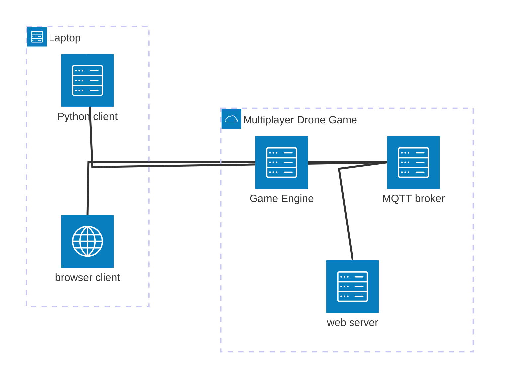
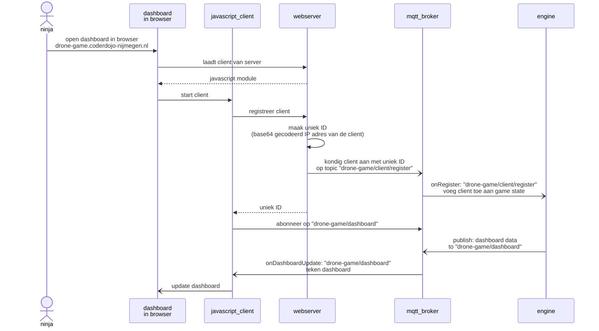
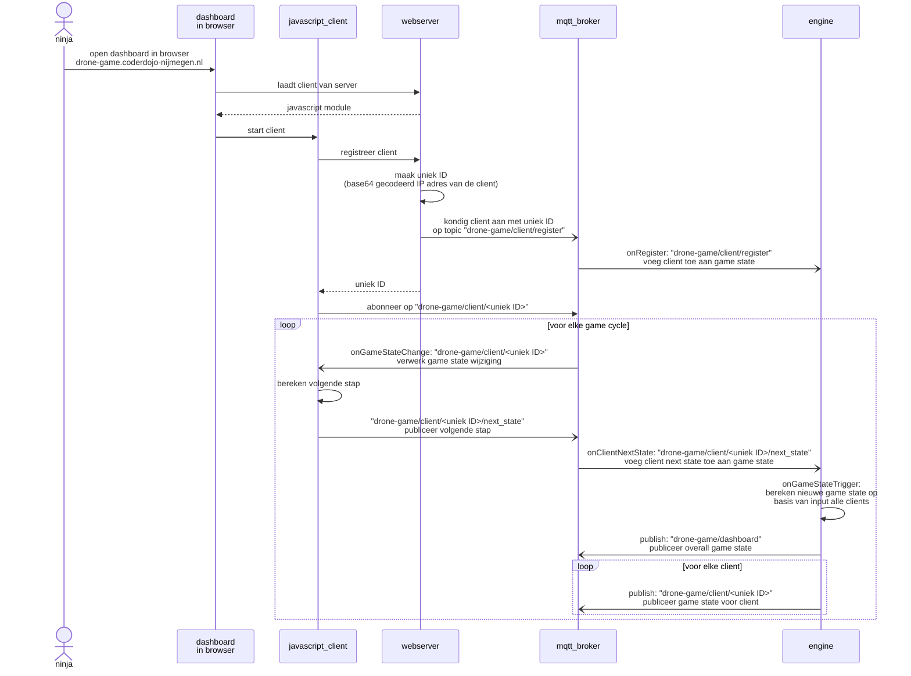

# Software requirements voor de Drone Multi-player Game

## Systeem

- we gebruiken een centrale server met een domeinnaam: drone-game.coderdojo-nijmegen.nl
    - doordat we een centrale server gebruiken, hoeven we geen discovery mechanismen te implementeren (één van de functionaliteiten van Network Zero)
- we gebruiken MQTT voor de communicatie
    - want beschikbaar in de browser (Javascript) en in Python
    - want bi-directioneel, waardoor de client event-driven kan zijn en geen polling mechanisme hoeft te implementeren
    - overweging MQTT:
        - handig subscriben op topics (bijvoorbeeld game state)
        - kan eenvoudig event-driven worden gebruikt voor ontvangen van informatie
        - extra container, naast gameserver container
        - adresseren clients via topicnaam of message body?

### Architectuur

De Ninja speelt het spel op haar/zijn laptop. Dat kan met een Python script in Thonny, maar ook in Visual Studio Code met Javascript wat in de browser wordt uitgevoegd.

- Python client: 
- Browser client: 
- MQTT broker: berichten schakelpunt waar verschillende blokken in het systeem 
- Game engine: ontvangt berichten van de clients via het schakelpunt en verwerkt de informatie in de game state
- web server: serveert een dashboard dat een overzicht toont van de bibliotheken, boekentorens en vliegende drones, biedt ook een paar endpoints om een nieuwe client aan te melden bij de game engine

## Clients

### Javascript

#### Dashboard

#### Drone besturen

