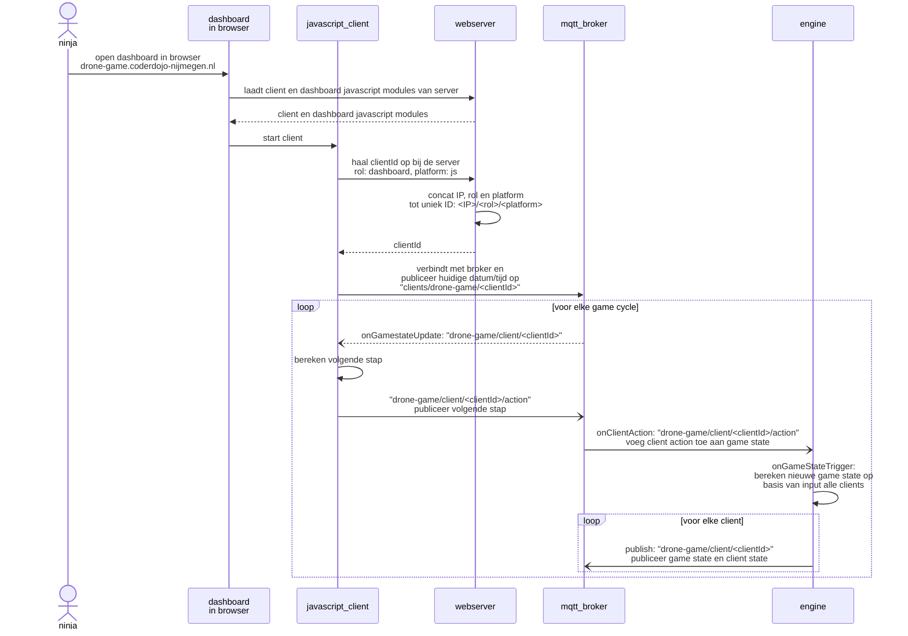

# Software requirements voor de Drone Multi-player Game

## Systeem

- we gebruiken een centrale server met een domeinnaam: drone-game.coderdojo-nijmegen.nl
    - doordat we een centrale server gebruiken, hoeven we geen discovery mechanismen te implementeren (één van de functionaliteiten van Network Zero)
- we gebruiken MQTT voor de communicatie
    - want beschikbaar in de browser (Javascript) en in Python
    - want bi-directioneel, waardoor de client event-driven kan zijn en geen polling mechanisme hoeft te implementeren
    - overweging MQTT:
        - handig subscriben op topics (bijvoorbeeld game state)
        - kan eenvoudig event-driven worden gebruikt voor ontvangen van informatie
        - extra container, naast gameserver container
        - adresseren clients via topicnaam of message body?

### Architectuur

De Ninja speelt het spel op haar/zijn laptop. Dat kan met een Python script in Thonny, maar ook in Visual Studio Code met Javascript wat in de browser wordt uitgevoegd.

- Python client: 
- Browser client: 
- MQTT broker: berichten schakelpunt waar verschillende blokken in het systeem 
- Game engine: ontvangt berichten van de clients via het schakelpunt en verwerkt de informatie in de game state
- web server: serveert een dashboard dat een overzicht toont van de bibliotheken, boekentorens en vliegende drones, biedt ook een paar endpoints om een nieuwe client aan te melden bij de game engine

## Clients

De clients hebben verschillende rollen en geven die ook mee aan de server voor het bepalen van het client ID. Dit maakt het mogelijk om zowel een dashboard als gamer rol
op één machine te laten werken. Het clientId voor het verbinden aan de MQTT broker moet uniek zijn, dus met enkel het IP adres als clientId gebruiken zou het dan niet mogelijk
zijn om zowel een dashboard als gamer vanaf één machine te draaien. De gamer kan vervolgens nog geïmplementeerd worden in Javascript en Python en van dezelfde machine worden
uitgevoerd, hoewel dat een uitzonderlijke situatie zal zijn.

Mogelijke rollen zijn:

- gamer/py
- gamer/js
- dashboard/js

De mogelijke clientId's worden dan:

- `<IP>/gamer/py`: gamer geïmplementeerd in Python
- `<IP>/gamer/js`: gamer geïmplementeerd in Javascript
- `<IP>/dashboard/js`: dashboard geïmplementeerd in Javascript, tevens enige implmentatie
- `engine`: game engine
- `bot`: bot die eventueel ingezet wordt om de drones te laten bewegen; handig bij het testen van de playground

### Javascript

#### Dashboard

#### Drone besturen

# Topics

## `clients/drone-game/#`

* `clients/drone-game/<IP>/<rol>/<platform>`
* `clients/drone-game/bot`
* `clients/drone-game/engine`

Een client haalt 

## `drone-game/client/<IP>/<rol>`

## `drone-game/client/<IP>/gamer/action`
